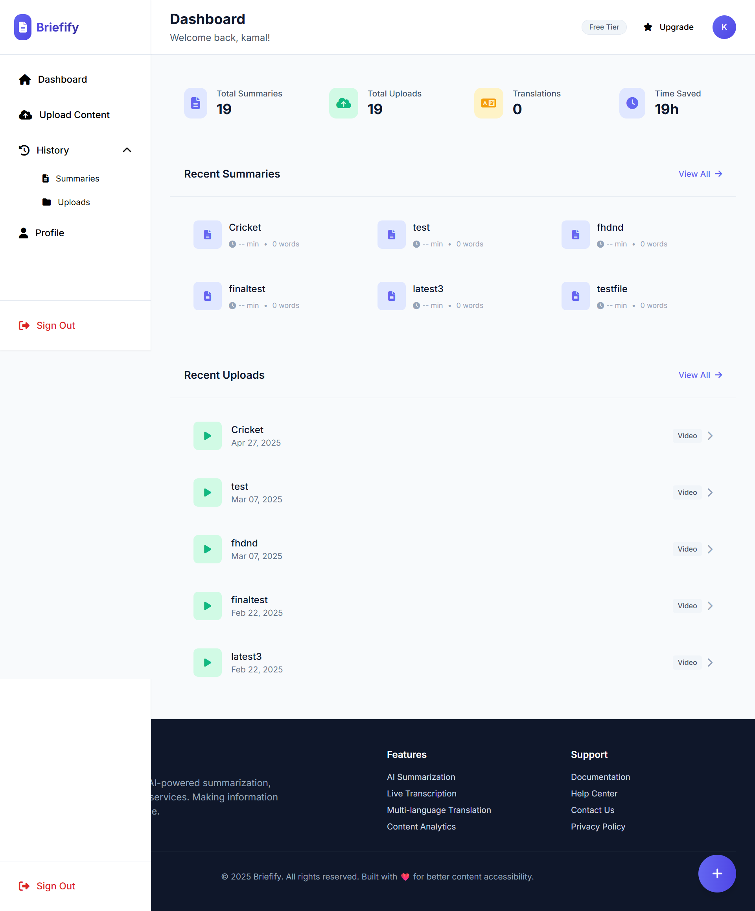
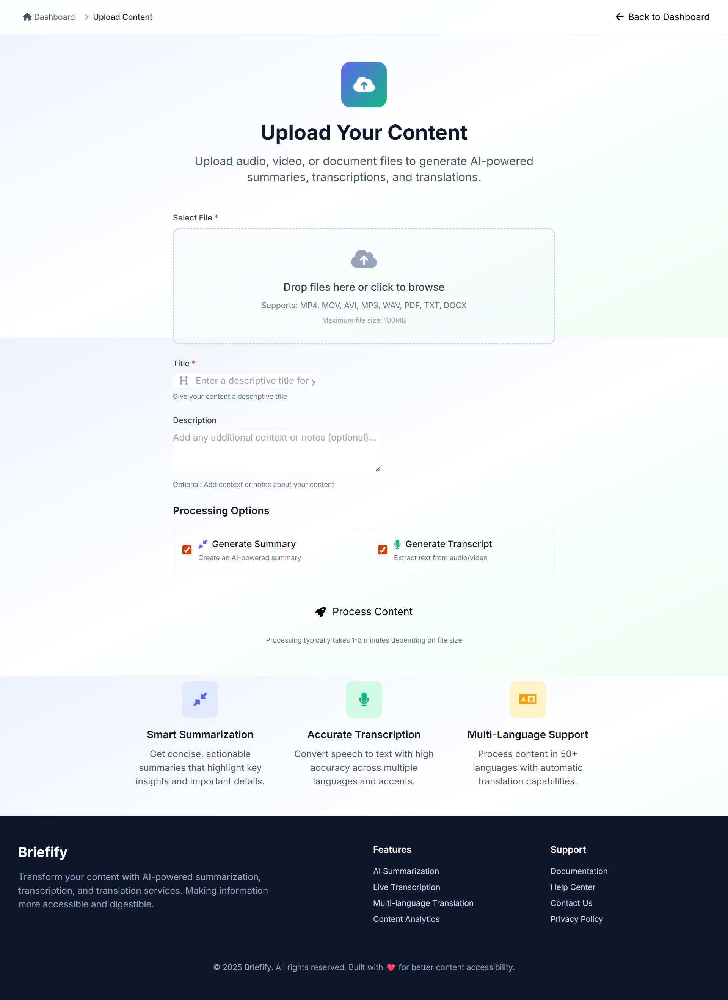
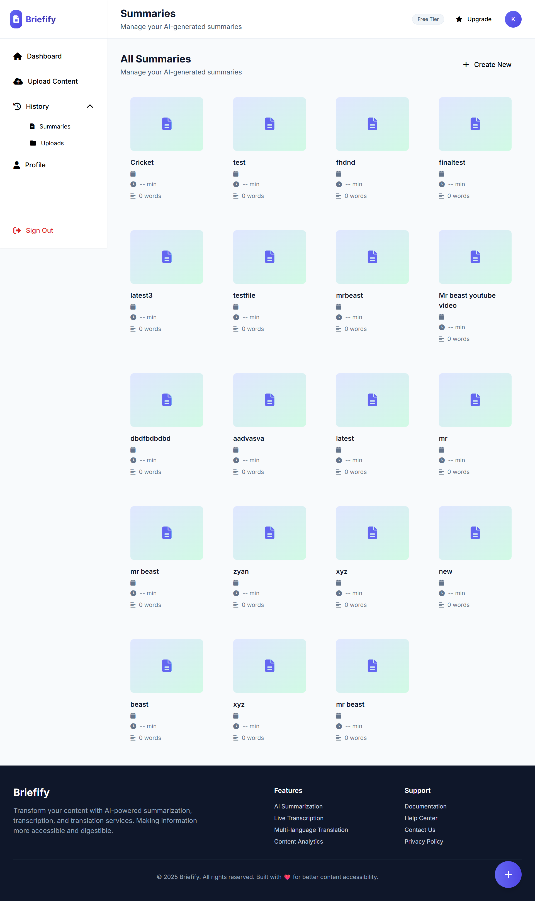

# 🎯 Briefify - AI-Powered Content Summarization Platform

<div align="center">

.png)

[](https://python.org)
[](https://djangoproject.com)
[](LICENSE)
[](http://makeapullrequest.com)

*Transform your content into actionable insights with AI-powered transcription, summarization, and translation*

[🚀 Live Demo](#demo) • [📖 Documentation](#documentation) • [🛠️ Installation](#installation) • [🤝 Contributing](#contributing)

</div>

## 📋 Table of Contents

- [Overview](#overview)
- [🖼️ User Interface](#user-interface)
- [✨ Key Features](#key-features)
- [🏗️ Architecture](#architecture)
- [🛠️ Technology Stack](#technology-stack)
- [⚡ Installation Guide](#installation-guide)
- [🔧 Configuration](#configuration)
- [📚 Usage Guide](#usage-guide)
- [🧪 Testing](#testing)
- [🚀 Deployment](#deployment)
- [🤝 Contributing](#contributing)
- [📄 License](#license)
- [👥 Authors](#authors)
- [📞 Support](#support)

## 🎯 Overview

**Briefify** is a cutting-edge web application that revolutionizes content management by automatically converting audio/video recordings and documents into comprehensive summaries, actionable insights, and multilingual translations. Built with Django and powered by state-of-the-art AI models, Briefify streamlines content processing workflows for teams, organizations, and individuals.

###  Why Briefify?

- **⏰ Save Time**: Reduce hours of manual processing to minutes of automated analysis
- **🎯 Extract Value**: Identify key insights and action items automatically  
- **🌍 Global Accessibility**: Translate content into 50+ languages
- **📊 Data-Driven**: Track content metrics and improve productivity
- **🔐 Secure**: Enterprise-grade security for sensitive content
- **🤖 AI-Powered**: Latest NLP and ML technologies for accurate results

## 🖼️ User Interface

### 🏠 Modern Homepage
Our redesigned homepage showcases Briefify's capabilities with a clean, professional interface:

.png)

### 📊 Comprehensive Dashboard
Manage all your content and view analytics from a centralized dashboard:



### ☁️ Intuitive Upload Interface  
Upload and process your content with our drag-and-drop interface:



### 📚 Content History & Management
Access and manage all your processed content efficiently:



## ✨ Key Features

### 🎵 Core AI Capabilities

- **🎯 Smart Summarization**: AI-powered content analysis that extracts key insights and creates concise, actionable summaries
- **🎤 Advanced Transcription**: High-accuracy speech-to-text conversion supporting multiple languages and accents  
- **📝 Action Item Extraction**: Automatically identifies and lists action items within transcripts
- **⏱️ Meeting Analytics**: Tracks meeting duration, participant engagement, and key metrics
- **🌐 Multi-Language Translation**: Translate summaries and content into 50+ globally supported languages
- **💾 Secure Storage**: Comprehensive storage system for previous uploads, summaries, and processed content
- **🤖 AI Assistant**: Intelligent chatbot to help users navigate and understand the platform
- **🔓 Open Source**: Community-driven development with transparent, accessible codebase

### 🚀 Modern Features

- **📱 Responsive Design**: Optimized for desktop, tablet, and mobile devices
- **⚡ Real-time Processing**: Live transcription and instant summary generation
- **🎨 Modern UI/UX**: Clean, professional interface built with latest design principles
- **🔐 Enterprise Security**: Advanced encryption and secure data handling
- **📊 Analytics Dashboard**: Comprehensive insights and content management
- **🔄 Batch Processing**: Handle multiple files simultaneously
- **🎯 Custom Workflows**: Tailored processing options for different content types


## 🛠️ Technology Stack

### 🖥️ Frontend Technologies
- **HTML5 & CSS3**: Modern semantic markup and responsive styling
- **JavaScript (ES6+)**: Interactive user interface and real-time features
- **Tailwind CSS**: Utility-first CSS framework for modern design
- **Font Awesome**: Professional iconography and visual elements
- **Responsive Design**: Fully optimized for all device sizes

### ⚙️ Backend Technologies  
- **Django 4.1.13**: Robust Python web framework
- **SQLite3**: Lightweight, efficient database system
- **Django REST Framework**: API development and management
- **Python 3.7+**: Core backend programming language

### 🤖 AI & ML Libraries
- **OpenAI Whisper**: State-of-the-art speech recognition
- **Transformers**: Hugging Face NLP model library
- **BART CNN**: Advanced text summarization model
- **PyTorch**: Deep learning framework
- **NLTK**: Natural language processing toolkit
- **Deep Translator**: Multi-language translation capabilities

### 🔧 System Requirements
- **CUDA Support**: GPU acceleration for AI processing
- **FFmpeg**: Media file processing and conversion
- **NumPy**: Numerical computing support

- **FFmpeg**: Media file processing and conversion
- **NumPy**: Numerical computing support

## ⚡ Installation Guide

### 📋 Prerequisites

Before installing Briefify, ensure you have the following prerequisites:

- **Python 3.7+** - [Download Python](https://www.python.org/downloads/)
- **NVIDIA GPU with CUDA support** (recommended for optimal AI performance)
- **FFmpeg** - [Download FFmpeg](https://github.com/BtbN/FFmpeg-Builds/releases)
- **Git** - For cloning the repository

### 🚀 Quick Installation

1. **Clone the Repository**
```bash
git clone https://github.com/Kamal-dev-1999/hackanova.git
cd hackanova/brefify
```

2. **Create Virtual Environment**
```bash
python -m venv env
# On Windows
env\Scripts\activate
# On macOS/Linux  
source env/bin/activate
```

3. **Install Dependencies**
```bash
pip install -r requirements.txt
```

4. **Install AI Libraries**
```bash
# OpenAI Whisper for speech recognition
pip install -U openai-whisper
pip install git+https://github.com/openai/whisper.git

# Transformers for NLP
pip install transformers
pip install transformers-sentencepiece

# Additional dependencies
pip install deep-translator
pip install langdetect
pip install nltk
```

5. **Setup Database**
```bash
python manage.py migrate
python manage.py createsuperuser  # Optional: create admin user
```

6. **Run the Application**
```bash
python manage.py runserver
```

Visit `http://127.0.0.1:8000` to access Briefify!

### 🐳 Docker Installation (Alternative)

```bash
# Clone repository
git clone https://github.com/Kamal-dev-1999/hackanova.git
cd hackanova/brefify

# Build and run with Docker
docker build -t briefify .
docker run -p 8000:8000 briefify
```

### ⚙️ CUDA Setup (Optional but Recommended)

For GPU acceleration:
1. Install [CUDA Toolkit 11.6+](https://developer.nvidia.com/cuda-11-6-0-download-archive)
2. Install PyTorch with CUDA support:
```bash
pip install torch torchvision torchaudio --index-url https://download.pytorch.org/whl/cu118
```

## 📚 Usage Guide

### 🚀 Getting Started

1. **Access the Platform**: Navigate to `http://127.0.0.1:8000`
2. **Create Account**: Register or log in to your Briefify account
3. **Upload Content**: Use the drag-and-drop interface to upload audio, video, or document files
4. **Select Options**: Choose summarization, transcription, and translation preferences
5. **Process Content**: Let AI analyze and generate insights from your content
6. **Review Results**: Access summaries, transcripts, and translations from your dashboard

### 🎯 Key Workflows

- **Meeting Summarization**: Upload meeting recordings to get key insights and action items
- **Document Processing**: Extract summaries from lengthy documents and reports  
- **Multi-Language Support**: Translate content into your preferred language
- **Batch Processing**: Handle multiple files simultaneously for efficiency
- **Content Management**: Organize and search through your processed content library

### 📊 Features Overview


## 🤝 Contributing

We welcome contributions from the community! Here's how you can help:

### 🛠️ Development Setup
1. Fork the repository
2. Create a feature branch: `git checkout -b feature/amazing-feature`
3. Make your changes and test thoroughly
4. Commit your changes: `git commit -m 'Add amazing feature'`
5. Push to the branch: `git push origin feature/amazing-feature`
6. Open a Pull Request

### 📋 Contribution Guidelines
- Follow PEP 8 style guidelines for Python code
- Write clear, descriptive commit messages
- Add tests for new features
- Update documentation as needed
- Ensure all tests pass before submitting PR

## 📄 License

This project is licensed under the MIT License - see the [LICENSE](LICENSE) file for details.

## 👥 Authors & Contributors

### Core Team
- **[@Parikshit-007](https://github.com/Parikshit-007)** - Lead Developer & AI Integration
- **[@AakashSingh20](https://github.com/AakashSingh20)** - Backend Development & Architecture
- **[@Kamal-dev-1999](https://github.com/Kamal-dev-1999)** - UI/UX Design & Frontend Development

### Special Thanks
- OpenAI team for Whisper speech recognition
- Hugging Face for transformer models
- Django community for the robust framework

## 📞 Support & Contact

### 🐛 Found a Bug?
- Open an issue on [GitHub Issues](https://github.com/Kamal-dev-1999/hackanova/issues)
- Provide detailed reproduction steps
- Include system information and error logs

### 💬 Need Help?
- Check our [Documentation](https://github.com/Kamal-dev-1999/hackanova/wiki)
- Join our [Discord Community](https://discord.gg/briefify)
- Email us at: support@briefify.ai

### 🌟 Show Your Support
If you found this project helpful, please consider:
- ⭐ Starring the repository
- 🐛 Reporting bugs and issues  
- 💡 Suggesting new features
- 📢 Sharing with others

---

<div align="center">

**Made with ❤️ by the Briefify Team**

[🌐 Website](https://briefify.ai) • [📧 Email](mailto:contact@briefify.ai) • [🐦 Twitter](https://twitter.com/briefify) • [💼 LinkedIn](https://linkedin.com/company/briefify)

</div>

